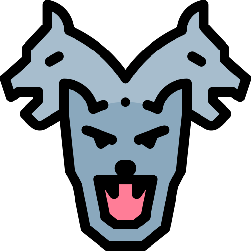

<p align="center">
    
</p>

# Bridging Bug Localization and Issue Fixing: A Hierarchical Localization Framework Leveraging Large Language Models

To enhance the precision of issue fixing by accurately identifying bug locations in large-scale projects, this project presents **BugCerberus**, the first hierarchical bug localization framework powered by three customized large language models (LLMs). 

- **BugCerberus** analyzes intermediate representations of bug-related programs at **file, function, and statement levels**, extracting bug-related contextual information from these representations.
- At each level, **BugCerberus** employs customized LLMs trained using bug reports and code contexts to learn bug patterns.
- Finally, BugCerberus hierarchically searches for bug-related code elements across all three levels, using the well-tuned models to localize bugs.

With BugCerberus, we further investigate the impact of bug localization precision on the effectiveness of issue fixing.

---

## Project Structure


### Directory Explanation

- **data**  
    Contains model checkpoints, repair results, and training data samples used in BugCerberus.


- **src**  
    Contains the source code for model training, including scripts for fine-tuning 
**BugCerberus** using LLaMA models.

- **Static Analysis**  
    Provides scripts for extracting code context at three granularity levels: **file-level**, **function-level**, and **statement-level**.

---

## Installation

### 1. Python Environment
We recommend Python 3.10–3.11. Create a virtual environment and install dependencies:

```bash
python3 -m venv .venv
source .venv/bin/activate  
pip install --upgrade pip setuptools wheel
pip install -r requirements.txt
```
### 2. Joern 

[Joern](https://github.com/joernio/joern) is used to build Code Property Graphs (CPGs) for dependency analysis.

**Download & Setup**
```bash
mkdir -p $HOME/tools && cd $HOME/tools
wget https://github.com/joernio/joern/releases/latest/download/joern.zip
unzip joern.zip -d joern
export PATH="$HOME/tools/joern:$PATH"

**Install Language Frontends**
```bash
joern-install.sh    # installs Java/Python frontends
```
#### Option A: CLI Commands
This method directly calls Joern’s built-in commands:

```bash
# Step 1: Parse project into CPG
./joern-parse /path/to/project --out cpg.bin

# Step 2: Export to Neo4j CSV format
./joern-export --repr=all --format=neo4jcsv --out neo4j-output-dir cpg.bin
```
#### Option B: Static Analysis Scripts
Alternatively, you can rely on the helper scripts in the **Static Analysis** folder:

- In **GenerateSDG.py**, the functions `generateNeo4jCSVs` and `generateNEO4J` provide batch interfaces for converting source projects into Neo4j-compatible dependency graphs.  
- In **GenerateSlice.py**, the function `generateEntrance` provides a batch interface for slice generation based on the dependency graph.

#### **Notes for Neo4j Configuration and Cypher Files**

- **Update Neo4j Configuration:**  
  To allow Neo4j to import files generated by Joern, open your local Neo4j configuration file (typically `neo4j.conf`) and **remove or comment out** the following line that restricts external file imports:
  ```bash
  server.directories.import=import
   ```
  This modification enables Neo4j to load CSV files from any directory on your system.

- **Adjust Paths in Cypher Files:**
Joern-generated Cypher scripts often contain absolute paths referencing the original export directory. Before executing these scripts, replace the prefix path with your own local path where the Cypher or CSV files are stored.


### 3. LlamaFactory (Model Fine-Tuning)

[LlamaFactory](https://github.com/hiyouga/LLaMA-Factory) provides an easy interface for training and inference of large models.

**Option A: Install from PyPI**
```bash
pip install llamafactory
```
**Option B: Install from source **
```bash
git clone https://github.com/hiyouga/LLaMA-Factory.git
cd LLaMA-Factory
pip install -e ".[metrics]"
cd ..
```
**Quick Test**
```bash
llamafactory-cli --help
llamafactory webui   # Start Web UI (http://127.0.0.1:7860)
```

### Fine-tuning BugCerberus with LlamaFactory

Following the data format required by [LlamaFactory](https://github.com/hiyouga/LLaMA-Factory), place your training dataset into the `dataset_dir` directory. Then run the following command to fine-tune the BugCerberus model:

Navigate to the `src` directory and run:

```bash
llamafactory-cli train \
    --stage sft \
    --do_train \
    --model_name_or_path modelPath \
    --dataset trainDataSet \
    --dataset_dir ./data \
    --template llama3 \
    --finetuning_type lora \
    --output_dir output_dir \
    --overwrite_cache \
    --overwrite_output_dir \
    --cutoff_len 1024 \
    --preprocessing_num_workers 16 \
    --per_device_train_batch_size 10 \
    --per_device_eval_batch_size 4 \
    --gradient_accumulation_steps 8 \
    --lr_scheduler_type cosine \
    --logging_steps 500 \
    --warmup_steps 750 \
    --save_steps 1500 \
    --eval_steps 1500 \
    --evaluation_strategy steps \
    --load_best_model_at_end \
    --learning_rate 5e-5 \
    --num_train_epochs 3.0 \
    --val_size 0.1 \
    --plot_loss \
    --fp16
```


##Acknowledgments
arts of the code are adapted from [Joern](https://github.com/joernio/joern) and [LlamaFactory](https://github.com/hiyouga/LLaMA-Factory).
